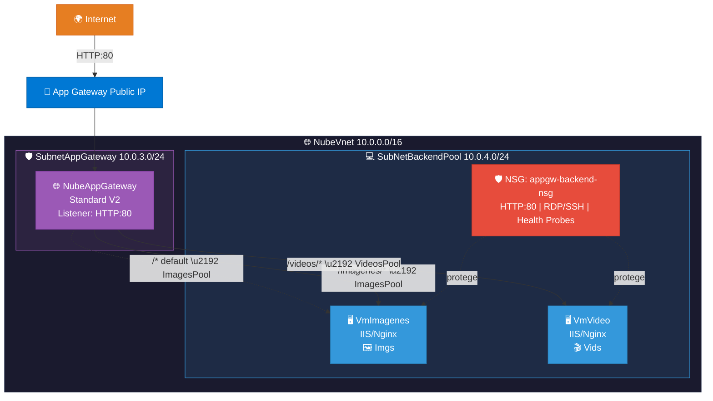

# 🌐 Application Gateway con Enrutamiento por URL

Scripts de despliegue automatizado de un **Azure Application Gateway (Standard V2)** con enrutamiento basado en rutas URL hacia dos servidores backend. Se incluyen dos versiones: una con **Windows Server + IIS** y otra con **Linux Ubuntu + Nginx**.

---

## 📋 Índice

- [Scripts disponibles](#-scripts-disponibles)
- [Arquitectura](#-arquitectura)
- [Prerequisitos](#-prerequisitos)
- [Uso](#-uso)
- [Recursos creados](#-recursos-creados)
- [Reglas de enrutamiento](#-reglas-de-enrutamiento)
- [Verificación](#-verificación)
- [Parámetros configurables](#-parámetros-configurables)
- [Comparativa Windows vs Linux](#-comparativa-windows-vs-linux)

---

## 📂 Scripts disponibles

| Script | SO | Web Server | Acceso remoto |
|---|---|---|---|
| `app_gateway.sh` | Windows Server 2022 | IIS | RDP (3389) |
| `app_gateway2.sh` | Ubuntu 22.04 LTS | Nginx | SSH (22) |

Ambos scripts son **idempotentes y no destructivos**, desplegando la misma arquitectura de Application Gateway con enrutamiento basado en URL.

---

## 📝 Descripción

### `app_gateway.sh` — Windows Server + IIS

Script Bash **idempotente y no destructivo** que despliega:

- Red virtual con dos subredes (App Gateway + Backend)
- Network Security Group (NSG) con reglas HTTP, RDP y health probes
- Dos VMs Windows Server 2022 sin IP pública, con IIS:
  - **VmImagenes**: sirve contenido de imágenes
  - **VmVideo**: sirve contenido de videos
- Application Gateway (Standard V2) con IP pública
- Dos Backend Pools (ImagesPool, VideosPool)
- URL Path Map para enrutamiento basado en ruta
- Regla de enrutamiento con prioridad 1

### `app_gateway2.sh` — Linux Ubuntu + Nginx

Script Bash **idempotente y no destructivo** que despliega:

- Red virtual con dos subredes (App Gateway + Backend)
- Network Security Group (NSG) con reglas HTTP, SSH y health probes
- Dos VMs Ubuntu 22.04 LTS sin IP pública, con Nginx:
  - **VmImagenes**: sirve contenido de imágenes
  - **VmVideo**: sirve contenido de videos
- Application Gateway (Standard V2) con IP pública
- Dos Backend Pools (ImagesPool, VideosPool)
- URL Path Map para enrutamiento basado en ruta
- Regla de enrutamiento con prioridad 1

---

## 🏗️ Arquitectura



> **app_gateway.sh** usa Windows Server 2022 + IIS · **app_gateway2.sh** usa Ubuntu 22.04 + Nginx

---

## ✅ Prerequisitos

- Azure CLI instalado y autenticado (`az login`)
- Suscripción Azure activa con permisos de **Contributor**
- Ejecutar en **Azure Cloud Shell (Bash)** o terminal con `az` CLI

---

## 🚀 Uso

### Cargar los scripts en Azure Cloud Shell

**Opción 1 — Clonar el repositorio:**
```bash
git clone https://github.com/qwermk/Curso-Arquitectura-Nube.git
cd "Curso-Arquitectura-Nube/Aplication Gateway"
```

**Opción 2 — Subir archivo manualmente:**
1. Abrir [Azure Cloud Shell](https://shell.azure.com) (Bash)
2. Clic en el ícono **📤 Cargar/Descargar archivos** en la barra de herramientas
3. Seleccionar **Cargar** y elegir el script (`.sh`) deseado
4. El archivo se sube a `$HOME/`

**Opción 3 — Copiar y pegar:**
1. Abrir el script en GitHub y copiar todo el contenido
2. En Cloud Shell: `nano app_gateway.sh` (o `app_gateway2.sh`)
3. Pegar, guardar con `Ctrl+O` y salir con `Ctrl+X`

### Ejecutar

**Versión Windows (IIS):**
```bash
chmod +x app_gateway.sh
bash app_gateway.sh
```

**Versión Linux (Nginx):**
```bash
chmod +x app_gateway2.sh
bash app_gateway2.sh
```

> ⚠️ **NO** ejecutar con `source` (si hay error, cierra la sesión).  
> ⚠️ Ambos scripts crean los **mismos recursos** (mismo nombre). Ejecutar solo **uno** a la vez, o borrar el Resource Group antes de ejecutar el otro.

El script tarda aproximadamente **20-30 minutos** (el Application Gateway es el recurso que más tarda).

---

## 📦 Recursos creados

| Recurso | Nombre | Descripción |
|---|---|---|
| Resource Group | `GrupoNube` | Contenedor de todos los recursos |
| VNet | `NubeVnet` | Red virtual 10.0.0.0/16 |
| Subred App Gateway | `SubnetAppGateway` | 10.0.3.0/24 (exclusiva del gateway) |
| Subred Backend | `SubNetBackendPool` | 10.0.4.0/24 (VMs backend) |
| NSG | `appgw-backend-nsg` | Reglas HTTP, RDP/SSH y health probes |
| Application Gateway | `NubeAppGateway` | Standard V2, capacidad 2 |
| Backend Pool | `ImagesPool` | VmImagenes |
| Backend Pool | `VideosPool` | VmVideo |
| HTTP Settings | `Settings1` | HTTP:80, timeout 30s |
| VM Imágenes | `VmImagenes` | Windows Server 2022 + IIS ó Ubuntu 22.04 + Nginx |
| VM Video | `VmVideo` | Windows Server 2022 + IIS ó Ubuntu 22.04 + Nginx |

---

## 🗺️ Reglas de enrutamiento

| Ruta | Backend Pool | VM Destino | Contenido |
|---|---|---|---|
| `/imagenes/*` | ImagesPool | VmImagenes | Galería de imágenes |
| `/videos/*` | VideosPool | VmVideo | Galería de videos |
| `/*` (default) | ImagesPool | VmImagenes | Página por defecto |

**Configuración de la regla:**
- **Nombre:** RoutingRule1
- **Prioridad:** 1
- **Listener:** listener1 (HTTP:80, IP pública)
- **Tipo:** Path-based Routing
- **Backend Settings:** Settings1

---

## 🔎 Verificación

Una vez completado el despliegue:

```bash
# Página por defecto (ImagesPool)
curl http://<APPGW_PUBLIC_IP>

# Galería de imágenes
curl http://<APPGW_PUBLIC_IP>/imagenes/

# Galería de videos
curl http://<APPGW_PUBLIC_IP>/videos/
```

Cada URL mostrará una página diferente, confirmando que el enrutamiento por path funciona correctamente.

---

## ⚙️ Parámetros configurables

| Variable | Valor por defecto | Descripción |
|---|---|---|
| `RESOURCE_GROUP` | `GrupoNube` | Nombre del Resource Group |
| `LOCATION` | `eastus2` | Región de Azure |
| `VNET_NAME` | `NubeVnet` | Nombre de la VNet |
| `SUBNET_APPGW_PREFIX` | `10.0.3.0/24` | CIDR subred App Gateway |
| `SUBNET_BACKEND_PREFIX` | `10.0.4.0/24` | CIDR subred Backend |
| `VM_SIZE` | `Standard_D2s_v3` / `Standard_B2s` | Tamaño de las VMs (Windows / Linux) |
| `WINDOWS_IMAGE` / `LINUX_IMAGE` | `Win2022Datacenter` / `Ubuntu2204` | Imagen del SO |
| `ADMIN_USER` | `azureuser` | Usuario administrador |
| `ADMIN_PASSWORD` | `Admin123456.` | Contraseña de administrador |
| `APPGW_SKU` | `Standard_v2` | SKU del Application Gateway |

---

## 🔄 Comparativa Windows vs Linux

| Aspecto | `app_gateway.sh` (Windows) | `app_gateway2.sh` (Linux) |
|---|---|---|
| **Sistema Operativo** | Windows Server 2022 | Ubuntu 22.04 LTS |
| **Servidor Web** | IIS | Nginx |
| **Tamaño VM** | Standard_D2s_v3 (2 vCPU, 8 GB) | Standard_B2s (2 vCPU, 4 GB) |
| **Acceso remoto** | RDP (puerto 3389) | SSH (puerto 22) |
| **Comando remoto** | RunPowerShellScript | RunShellScript |
| **Ruta web** | `C:\inetpub\wwwroot\` | `/var/www/html/` |
| **Costo estimado** | Mayor (VM más grande + licencia Windows) | Menor (VM más pequeña + SO gratuito) |
| **Tiempo de despliegue** | ~25-35 min | ~20-30 min |
