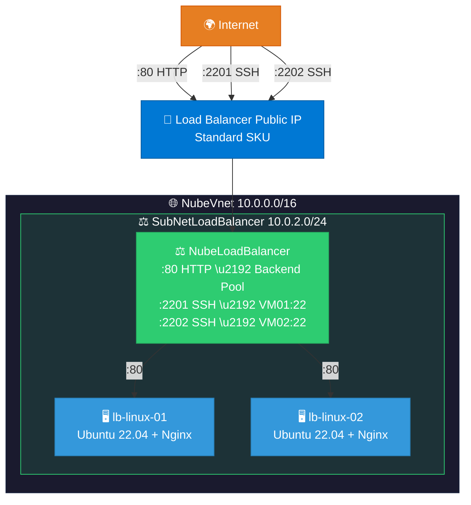

# ⚖️ Load Balancer con 2 VMs Linux

Script de despliegue automatizado de un **Azure Load Balancer (Standard)** con dos máquinas virtuales Linux como backend, incluyendo instalación de Nginx.

---

## 📋 Índice

- [Descripción](#-descripción)
- [Arquitectura](#-arquitectura)
- [Prerequisitos](#-prerequisitos)
- [Uso](#-uso)
- [Recursos creados](#-recursos-creados)
- [Acceso](#-acceso)
- [Verificación del balanceo](#-verificación-del-balanceo)
- [Parámetros configurables](#-parámetros-configurables)

---

## 📝 Descripción

`balanceadores.sh` es un script Bash **idempotente y no destructivo** que despliega:

- Red virtual con una subred dedicada para el Load Balancer
- Network Security Group (NSG) con reglas HTTP y SSH
- Azure Load Balancer (Standard SKU) con IP pública estática
- Health Probe TCP en puerto 80
- Regla de balanceo HTTP (puerto 80)
- NAT Rules para acceso SSH individual a cada VM
- Availability Set para alta disponibilidad
- Dos VMs Linux (Ubuntu 22.04) sin IP pública
- Nginx instalado con páginas personalizadas para verificar el balanceo

---

## 🏗️ Arquitectura



---

## ✅ Prerequisitos

- Azure CLI instalado y autenticado (`az login`)
- Suscripción Azure activa con permisos de **Contributor**
- Ejecutar en **Azure Cloud Shell (Bash)** o terminal con `az` CLI

---

## 🚀 Uso

### Cargar el script en Azure Cloud Shell

**Opción 1 — Clonar el repositorio:**
```bash
git clone https://github.com/qwermk/Curso-Arquitectura-Nube.git
cd "Curso-Arquitectura-Nube/Balanceador de carga"
```

**Opción 2 — Subir archivo manualmente:**
1. Abrir [Azure Cloud Shell](https://shell.azure.com) (Bash)
2. Clic en el ícono **📤 Cargar/Descargar archivos** en la barra de herramientas
3. Seleccionar **Cargar** y elegir `balanceadores.sh`
4. El archivo se sube a `$HOME/`

**Opción 3 — Copiar y pegar:**
1. Abrir el script en GitHub y copiar todo el contenido
2. En Cloud Shell: `nano balanceadores.sh`
3. Pegar, guardar con `Ctrl+O` y salir con `Ctrl+X`

### Ejecutar

```bash
chmod +x balanceadores.sh
bash balanceadores.sh
```

> ⚠️ **NO** ejecutar con `source` (si hay error, cierra la sesión).

El script tarda aproximadamente **10-15 minutos** en completarse.

---

## 📦 Recursos creados

| Recurso | Nombre | Descripción |
|---|---|---|
| Resource Group | `GrupNube` | Contenedor de todos los recursos |
| VNet | `NubeVnet` | Red virtual 10.0.0.0/16 |
| Subred | `SubNetLoadBalancer` | 10.0.2.0/24 para las VMs del LB |
| NSG | `lb-nsg` | Reglas de seguridad HTTP y SSH |
| Load Balancer | `NubeLoadBalancer` | Standard SKU con IP pública |
| Health Probe | `lb-health-probe` | TCP:80, intervalo 15s |
| Availability Set | `lb-availability-set` | Alta disponibilidad (2 FD, 5 UD) |
| VM 01 | `lb-linux-01` | Ubuntu 22.04 + Nginx |
| VM 02 | `lb-linux-02` | Ubuntu 22.04 + Nginx |

---

## 🌐 Acceso

Una vez completado el despliegue, el script muestra las IPs y comandos de acceso:

| Servicio | Comando |
|---|---|
| **HTTP (balanceado)** | `curl http://<LB_PUBLIC_IP>` |
| **SSH VM01** | `ssh azureuser@<LB_PUBLIC_IP> -p 2201` |
| **SSH VM02** | `ssh azureuser@<LB_PUBLIC_IP> -p 2202` |

---

## 🔄 Verificación del balanceo

Cada VM tiene una página Nginx con un color y nombre diferente. Al ejecutar `curl` varias veces, verás cómo el Load Balancer alterna entre ambas:

```bash
# Ejecutar varias veces:
curl http://<LB_PUBLIC_IP>

# Respuesta VM01: "🖥️ Servidor: lb-linux-01" (fondo morado)
# Respuesta VM02: "🖥️ Servidor: lb-linux-02" (fondo rosa)
```

---

## ⚙️ Parámetros configurables

Las variables están al inicio del script y pueden modificarse:

| Variable | Valor por defecto | Descripción |
|---|---|---|
| `RESOURCE_GROUP` | `GrupNube` | Nombre del Resource Group |
| `LOCATION` | `eastus2` | Región de Azure |
| `VNET_NAME` | `NubeVnet` | Nombre de la VNet |
| `SUBNET_LB_PREFIX` | `10.0.2.0/24` | CIDR de la subred del LB |
| `VM_SIZE` | `Standard_D2s_v3` | Tamaño de las VMs (2 vCPU, 8 GB) |
| `LINUX_IMAGE` | `Ubuntu2204` | Imagen del SO |
| `ADMIN_USER` | `azureuser` | Usuario administrador |
| `LB_SKU` | `Standard` | SKU del Load Balancer |
| `SSH_EXTERNAL_PORT_01` | `2201` | Puerto SSH externo para VM01 |
| `SSH_EXTERNAL_PORT_02` | `2202` | Puerto SSH externo para VM02 |
