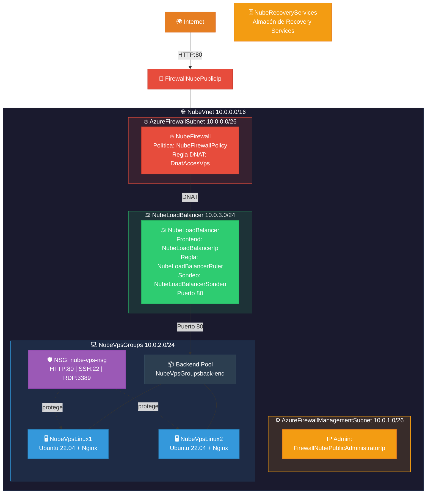

# 🔧 Laboratorio: Firewall + Load Balancer + Backup

Scripts de despliegue automatizado para el laboratorio completo de Azure. Se divide en dos fases:

| Script | Fase | Descripción |
|---|---|---|
| `deploy_before_class.sh` | Pre-clase | Infraestructura base: VNet, subredes, 2 VMs Linux + Nginx |
| `deploy_in_class.sh` | En clase | Load Balancer, Firewall con DNAT, Recovery Services |

---

## 📋 Índice

- [Arquitectura completa](#-arquitectura-completa)
- [Fase 1: Pre-clase (deploy_before_class.sh)](#-fase-1-pre-clase)
- [Fase 2: En clase (deploy_in_class.sh)](#-fase-2-en-clase)
- [Prerequisitos](#-prerequisitos)
- [Uso](#-uso)
- [Recursos creados](#-recursos-creados)
- [Verificación](#-verificación)
- [Parámetros configurables](#-parámetros-configurables)

---

## 🏗️ Arquitectura completa



---

## 📦 Fase 1: Pre-clase

### `deploy_before_class.sh`

Script Bash **idempotente y no destructivo** que despliega la infraestructura base:

- Grupo de recursos `GrupoNube`
- Red virtual con 4 subredes (Firewall, Firewall Management, VPS, Load Balancer)
- NSG con reglas HTTP (80), SSH (22) y RDP (3389)
- Dos VMs Linux (Ubuntu 22.04) con Nginx y página personalizada:
  - **NubeVpsLinux1**
  - **NubeVpsLinux2**

#### Script instalado en las VMs

```bash
#!/bin/bash
sudo su
apt-get -y update
apt-get -y upgrade
apt-get -y install nginx
echo "<h1>Hola Mundo desde $(hostname) <strong> Pendiente </strong> </h1>" > /var/www/html/index.html
```

---

## ⚖️ Fase 2: En clase

### `deploy_in_class.sh`

Script Bash **idempotente y no destructivo** que continúa el laboratorio desplegando:

### 4. Load Balancer

| Paso | Recurso | Nombre | Detalle |
|---|---|---|---|
| 4.1 | Grupo de recursos | `GrupoNube` | Mismo grupo de la Fase 1 |
| 4.2 | Load Balancer | `NubeLoadBalancer` | Balanceador de carga interno |
| 4.3 | IP del LB | `NubeLoadBalancerIp` | IP en subred `NubeLoadBalancer` |
| 4.4 | Backend Pool | `NubeVpsGroupsback-end` | Contiene NubeVpsLinux1 + NubeVpsLinux2 |
| 4.5 | Regla LB | `NubeLoadBalancerRuler` | Puerto 80 → Backend puerto 80 |
| 4.5.1 | Frontend IP | `NubeLoadBalancerIp` | Dirección IP del frontend |
| 4.5.2 | Backend Pool | `NubeVpsGroupsback-end` | Grupo de backend |
| 4.5.3 | Puerto frontend | `80` | Puerto de entrada |
| 4.5.4 | Puerto backend | `80` | Puerto de destino |
| 4.5.5 | Sondeo de estado | `NubeLoadBalancerSondeo` | Health probe TCP:80 |

### 5. Firewall

| Paso | Recurso | Nombre | Detalle |
|---|---|---|---|
| 5.1 | Firewall | `NubeFirewall` | Azure Firewall |
| 5.2 | Política | `NubeFirewallPolicy` | Política del Firewall |
| 5.2.3 | Red virtual | `NubeVnet` | VNet existente |
| 5.2.4 | IP pública | `FirewallNubePublicIp` | IP pública del Firewall |
| 5.2.5 | IP pública admin | `FirewallNubePublicAdministratorIp` | IP de administración |
| 5.2.5 | Regla DNAT | `NubeRulerDnatFirewall` | Colección de reglas DNAT |
| 5.2.5.1 | Regla | `DnatAccesVps` | Redirige tráfico a las VMs/LB |

### 6. Recovery Services

| Paso | Recurso | Nombre | Detalle |
|---|---|---|---|
| 6.1 | Almacén | `NubeRecoveryServices` | Almacén de Recovery Services para backup |
| 6.2 | Backup VM | `NubeVpsLinux1` | Backup con directiva `DefaultPolicy` |

---

## ✅ Prerequisitos

- Azure CLI instalado y autenticado (`az login`)
- Suscripción Azure activa con permisos de **Contributor**
- Ejecutar en **Azure Cloud Shell (Bash)** o terminal con `az` CLI

---

## 🚀 Uso

### Cargar los scripts en Azure Cloud Shell

**Opción 1 — Clonar el repositorio:**
```bash
git clone https://github.com/qwermk/Curso-Arquitectura-Nube.git
cd Curso-Arquitectura-Nube/Firewall+Load_Balancer+Backup
```

**Opción 2 — Subir archivos manualmente:**
1. Abrir [Azure Cloud Shell](https://shell.azure.com) (Bash)
2. Clic en el ícono **📤 Cargar/Descargar archivos** en la barra de herramientas
3. Seleccionar **Cargar** y elegir los scripts (`.sh`)
4. Los archivos se suben a `$HOME/`

**Opción 3 — Copiar y pegar:**
1. Abrir el script en GitHub y copiar todo el contenido
2. En Cloud Shell: `nano deploy_before_class.sh` (o `deploy_in_class.sh`)
3. Pegar, guardar con `Ctrl+O` y salir con `Ctrl+X`

### Ejecutar

**Fase 1 — Pre-clase** (ejecutar antes de la clase):
```bash
chmod +x deploy_before_class.sh
bash deploy_before_class.sh
```

**Fase 2 — En clase** (ejecutar durante la clase, después de Fase 1):
```bash
chmod +x deploy_in_class.sh
bash deploy_in_class.sh
```

> ⚠️ **NO** ejecutar con `source` (si hay error, cierra la sesión).  
> ⚠️ `deploy_in_class.sh` requiere que `deploy_before_class.sh` se haya ejecutado previamente.

---

## 📦 Recursos creados (total)

| Recurso | Nombre | Script | Descripción |
|---|---|---|---|
| Resource Group | `GrupoNube` | pre-clase | Contenedor de todos los recursos (eastus2) |
| VNet | `NubeVnet` | pre-clase | Red virtual 10.0.0.0/16 |
| Subred | `AzureFirewallSubnet` | pre-clase | 10.0.0.0/26 — 64 IPs |
| Subred | `AzureFirewallManagementSubnet` | pre-clase | 10.0.1.0/26 — 64 IPs |
| Subred | `NubeVpsGroups` | pre-clase | 10.0.2.0/24 — 256 IPs |
| Subred | `NubeLoadBalancer` | pre-clase | 10.0.3.0/24 — 256 IPs |
| NSG | `nube-vps-nsg` | pre-clase | HTTP:80, SSH:22, RDP:3389 |
| VM Linux | `NubeVpsLinux1` | pre-clase | Ubuntu 22.04 + Nginx |
| VM Linux | `NubeVpsLinux2` | pre-clase | Ubuntu 22.04 + Nginx |
| Load Balancer | `NubeLoadBalancer` | en-clase | Balanceador interno |
| IP del LB | `NubeLoadBalancerIp` | en-clase | Frontend IP |
| Backend Pool | `NubeVpsGroupsback-end` | en-clase | 2 VMs backend |
| Regla LB | `NubeLoadBalancerRuler` | en-clase | Puerto 80 → 80 |
| Health Probe | `NubeLoadBalancerSondeo` | en-clase | Sondeo TCP:80 |
| Firewall | `NubeFirewall` | en-clase | Azure Firewall |
| Política FW | `NubeFirewallPolicy` | en-clase | Política del Firewall |
| IP pública FW | `FirewallNubePublicIp` | en-clase | IP pública del Firewall |
| IP admin FW | `FirewallNubePublicAdministratorIp` | en-clase | IP de administración |
| Regla DNAT | `DnatAccesVps` | en-clase | Acceso a VMs via Firewall |
| Recovery Vault | `NubeRecoveryServices` | en-clase | Almacén de backup |
| Backup VM | `NubeVpsLinux1` | en-clase | Backup con directiva DefaultPolicy |

---

## 🔎 Verificación

Una vez ejecutados ambos scripts, se puede verificar el acceso desde Internet:

```bash
# Obtener la IP pública del Firewall
az network public-ip show -g GrupoNube -n FirewallNubePublicIp --query ipAddress -o tsv

# Acceder via la IP pública del Firewall (DNAT → LB → VMs)
curl http://<FIREWALL_PUBLIC_IP>
```

El flujo del tráfico es:
```
Internet → Firewall (DNAT) → Load Balancer → NubeVpsLinux1 / NubeVpsLinux2
```

---

## ⚙️ Parámetros configurables

| Variable | Valor por defecto | Descripción |
|---|---|---|
| `RESOURCE_GROUP` | `GrupoNube` | Nombre del Resource Group |
| `LOCATION` | `eastus2` | Región de Azure |
| `VNET_NAME` | `NubeVnet` | Nombre de la VNet |
| `SUBNET_FIREWALL_PREFIX` | `10.0.0.0/26` | CIDR subred Firewall |
| `SUBNET_FIREWALL_MGMT_PREFIX` | `10.0.1.0/26` | CIDR subred gestión Firewall |
| `SUBNET_VPS_PREFIX` | `10.0.2.0/24` | CIDR subred VMs |
| `SUBNET_LB_PREFIX` | `10.0.3.0/24` | CIDR subred Load Balancer |
| `VM_SIZE` | `Standard_D2s_v3` | Tamaño de las VMs |
| `LINUX_IMAGE` | `Ubuntu2204` | Imagen del SO |
| `ADMIN_USER` | `azureuser` | Usuario administrador |
| `ADMIN_PASSWORD` | `Admin123456.` | Contraseña de administrador |
