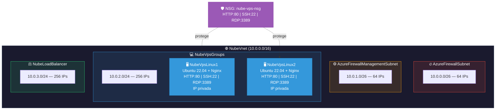

# 🔧 Pre-configuración de Recursos Azure

Script de despliegue automatizado para preparar la infraestructura Azure **antes de clase**. Crea la base de red, subredes y dos VMs Linux con Nginx listas para usar.

---

## 📋 Índice

- [Descripción](#-descripción)
- [Arquitectura](#-arquitectura)
- [Prerequisitos](#-prerequisitos)
- [Uso](#-uso)
- [Recursos creados](#-recursos-creados)
- [Verificación](#-verificación)
- [Parámetros configurables](#-parámetros-configurables)

---

## 📝 Descripción

`deploy_before_class.sh` es un script Bash **idempotente y no destructivo** que despliega:

- Grupo de recursos `GrupoNube`
- Red virtual con 4 subredes (Firewall, Firewall Management, VPS, Load Balancer)
- NSG con reglas HTTP (80), SSH (22) y RDP (3389)
- Dos VMs Linux (Ubuntu 22.04) con Nginx y página personalizada:
  - **NubeVpsLinux1**
  - **NubeVpsLinux2**

---

## 🏗️ Arquitectura



---

## ✅ Prerequisitos

- Azure CLI instalado y autenticado (`az login`)
- Suscripción Azure activa con permisos de **Contributor**
- Ejecutar en **Azure Cloud Shell (Bash)** o terminal con `az` CLI

---

## 🚀 Uso

```bash
chmod +x deploy_before_class.sh
bash deploy_before_class.sh
```

> ⚠️ **NO** ejecutar con `source` (si hay error, cierra la sesión).

El script tarda aproximadamente **5-10 minutos**.

---

## 📦 Recursos creados

| Recurso | Nombre | Descripción |
|---|---|---|
| Resource Group | `GrupoNube` | Contenedor de todos los recursos (eastus2) |
| VNet | `NubeVnet` | Red virtual 10.0.0.0/16 |
| Subred | `AzureFirewallSubnet` | 10.0.0.0/26 — 64 IPs (Firewall) |
| Subred | `AzureFirewallManagementSubnet` | 10.0.1.0/26 — 64 IPs (gestión Firewall) |
| Subred | `NubeVpsGroups` | 10.0.2.0/24 — 256 IPs (VMs) |
| Subred | `NubeLoadBalancer` | 10.0.3.0/24 — 256 IPs (Load Balancer) |
| NSG | `nube-vps-nsg` | Reglas HTTP:80, SSH:22, RDP:3389 |
| VM Linux | `NubeVpsLinux1` | Ubuntu 22.04 + Nginx, sin IP pública |
| VM Linux | `NubeVpsLinux2` | Ubuntu 22.04 + Nginx, sin IP pública |

### Script instalado en las VMs

```bash
#!/bin/bash
sudo su
apt-get -y update
apt-get -y upgrade
apt-get -y install nginx
echo "<h1>Hola Mundo desde $(hostname) <strong> Pendiente </strong> </h1>" > /var/www/html/index.html
```

---

## 🔎 Verificación

Las VMs **no tienen IP pública**. Para verificar que Nginx funciona, se puede acceder desde:

- **Azure Bastion** (conexión por navegador)
- **Otra VM en la misma VNet** (`curl http://<IP_PRIVADA>`)
- **Firewall con regla DNAT** (configurado en clase)

---

## ⚙️ Parámetros configurables

| Variable | Valor por defecto | Descripción |
|---|---|---|
| `RESOURCE_GROUP` | `GrupoNube` | Nombre del Resource Group |
| `LOCATION` | `eastus2` | Región de Azure |
| `VNET_NAME` | `NubeVnet` | Nombre de la VNet |
| `SUBNET_FIREWALL_PREFIX` | `10.0.0.0/26` | CIDR subred Firewall |
| `SUBNET_FIREWALL_MGMT_PREFIX` | `10.0.1.0/26` | CIDR subred gestión Firewall |
| `SUBNET_VPS_PREFIX` | `10.0.2.0/24` | CIDR subred VMs |
| `SUBNET_LB_PREFIX` | `10.0.3.0/24` | CIDR subred Load Balancer |
| `VM_SIZE` | `Standard_B2s` | Tamaño de la VM |
| `LINUX_IMAGE` | `Ubuntu2204` | Imagen del SO |
| `ADMIN_USER` | `azureuser` | Usuario administrador |
| `ADMIN_PASSWORD` | `Admin123456.` | Contraseña de administrador |
