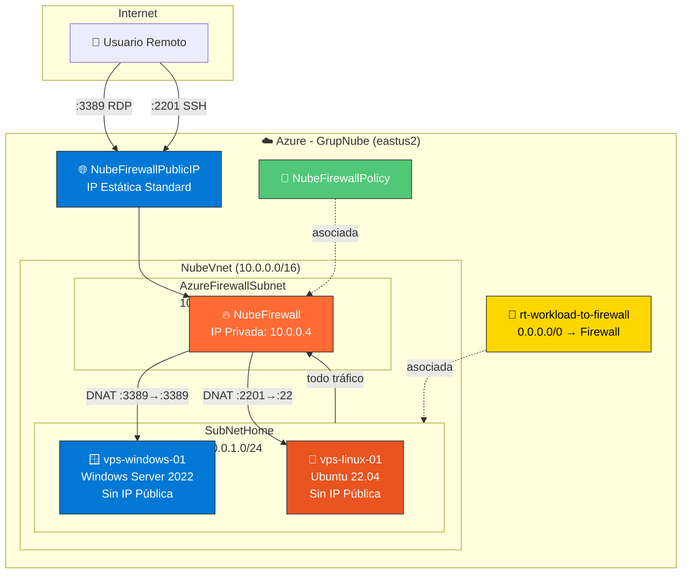
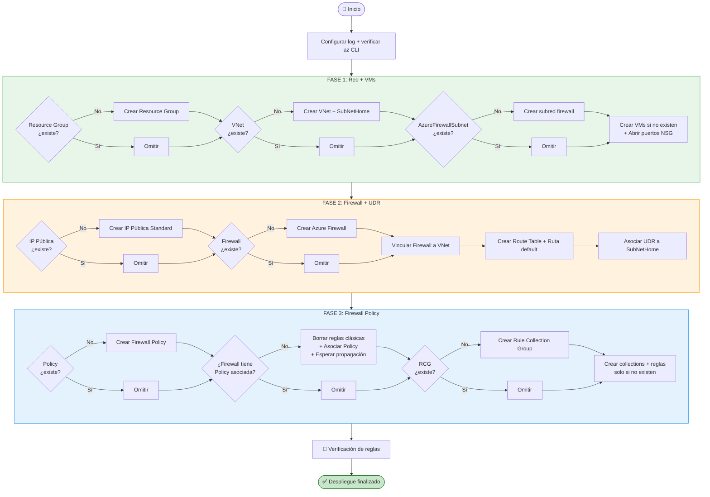
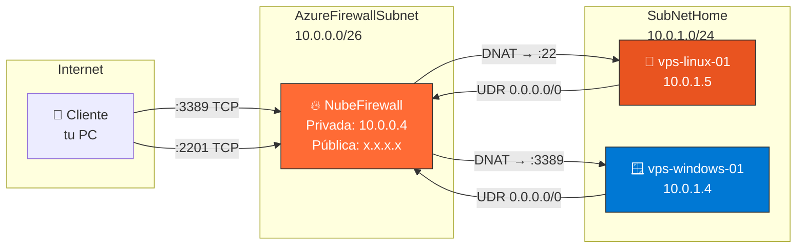
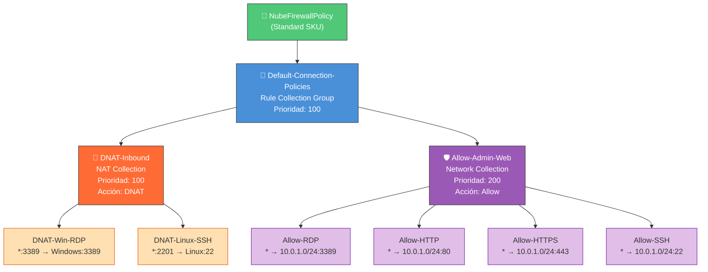
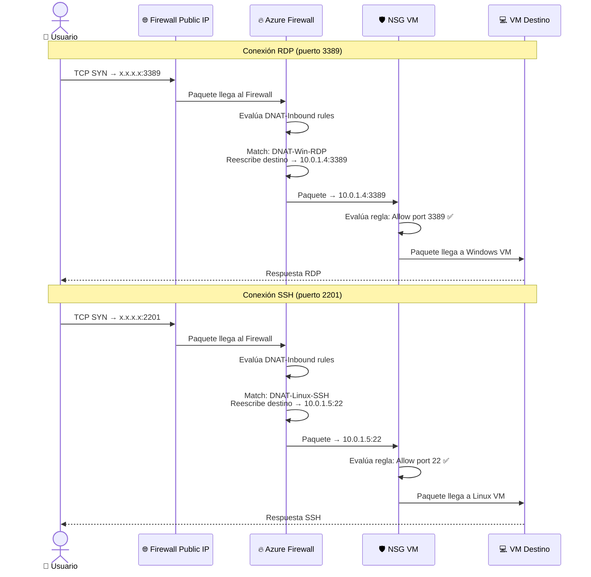
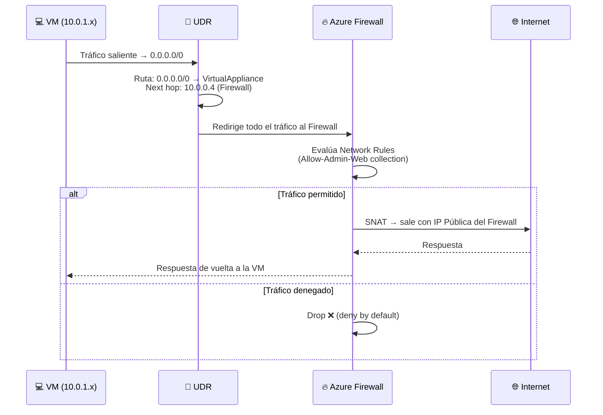
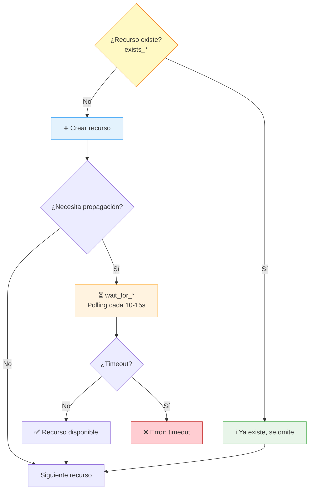
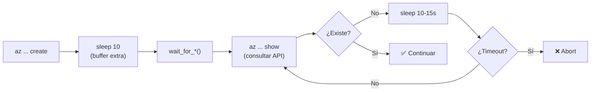

# 🚀 Deploy Azure Completo

Script de despliegue automatizado de infraestructura Azure con **Azure Firewall**, **DNAT**, **UDR** y **Firewall Policy**.

---

## 📋 Índice

- [Descripción](#-descripción)
- [Arquitectura](#-arquitectura)
- [Prerequisitos](#-prerequisitos)
- [Uso](#-uso)
- [Recursos creados](#-recursos-creados)
- [Flujo de ejecución](#-flujo-de-ejecución)
- [Topología de red](#-topología-de-red)
- [Firewall Policy — estructura de reglas](#-firewall-policy--estructura-de-reglas)
- [Flujo de tráfico DNAT](#-flujo-de-tráfico-dnat)
- [Flujo de tráfico saliente (UDR)](#-flujo-de-tráfico-saliente-udr)
- [Lógica de idempotencia](#-lógica-de-idempotencia)
- [Manejo de consistencia eventual](#-manejo-de-consistencia-eventual)
- [Parámetros configurables](#-parámetros-configurables)
- [Acceso a las VMs](#-acceso-a-las-vms)
- [Verificación](#-verificación)
- [Troubleshooting](#-troubleshooting)
- [Notas de seguridad](#-notas-de-seguridad)

---

## 📝 Descripción

`deploy-azure-completo.sh` es un script Bash **idempotente y no destructivo** que despliega una infraestructura completa en Azure:

- Red virtual con dos subredes (workload + firewall)
- Dos máquinas virtuales sin IP pública (Linux + Windows)
- Azure Firewall con IP pública estática
- Enrutamiento forzado (UDR) de toda la subred a través del Firewall
- Firewall Policy con reglas DNAT y Network

El script puede ejecutarse múltiples veces sin duplicar recursos ni borrar reglas existentes.

---

## 🏗️ Arquitectura



---

## ✅ Prerequisitos

| Requisito | Detalle |
|-----------|---------|
| **Azure CLI** | Instalado y autenticado (`az login`) |
| **Suscripción** | Azure activa con permisos de **Contributor** |
| **Entorno** | Azure Cloud Shell (Bash) o terminal con `az` CLI |
| **Bash** | Versión 4+ (Cloud Shell lo cumple) |

---

## 🚀 Uso

### Desde Azure Cloud Shell

1. Abrir [https://shell.azure.com](https://shell.azure.com) (modo **Bash**)
2. Subir el archivo con el botón **Upload** (📤)
3. Ejecutar:

```bash
chmod +x deploy-azure-completo.sh
bash deploy-azure-completo.sh
```

> ⚠️ **NUNCA usar `source`**: si hay un error, `set -e` + `exit` cerrarán tu sesión de Cloud Shell.

### Log de ejecución

El log completo se guarda en `~/deploy-azure-completo.log`:

```bash
cat ~/deploy-azure-completo.log
```

---

## 📦 Recursos creados

| # | Recurso | Nombre | Tipo |
|---|---------|--------|------|
| 1 | Resource Group | `GrupNube` | Contenedor lógico |
| 2 | Virtual Network | `NubeVnet` (10.0.0.0/16) | Red virtual |
| 3 | Subred Workload | `SubNetHome` (10.0.1.0/24) | Subred para VMs |
| 4 | Subred Firewall | `AzureFirewallSubnet` (10.0.0.0/26) | Subred exclusiva FW |
| 5 | VM Linux | `vps-linux-01` (Ubuntu 22.04) | Standard_D2s_v3 |
| 6 | VM Windows | `vps-windows-01` (Win Server 2022) | Standard_D2s_v3 |
| 7 | IP Pública | `NubeFirewallPublicIP` | Standard, Estática |
| 8 | Azure Firewall | `NubeFirewall` | Standard, AZFW_VNet |
| 9 | Route Table | `rt-workload-to-firewall` | UDR |
| 10 | Ruta | `default-to-firewall` | 0.0.0.0/0 → FW |
| 11 | Firewall Policy | `NubeFirewallPolicy` | Standard |
| 12 | Rule Collection Group | `Default-Connection-Policies` | Prioridad 100 |
| 13 | NAT Collection | `DNAT-Inbound` | Prioridad 100 |
| 14 | Network Collection | `Allow-Admin-Web` | Prioridad 200 |

### Reglas creadas

| Regla | Tipo | Origen | Destino | Puerto | Acción |
|-------|------|--------|---------|--------|--------|
| DNAT-Win-RDP | DNAT | `*` | Firewall IP `:3389` | → Windows `:3389` | Redirect |
| DNAT-Linux-SSH | DNAT | `*` | Firewall IP `:2201` | → Linux `:22` | Redirect |
| Allow-RDP | Network | `*` | `10.0.1.0/24` `:3389` | TCP | Allow |
| Allow-HTTP | Network | `*` | `10.0.1.0/24` `:80` | TCP | Allow |
| Allow-HTTPS | Network | `*` | `10.0.1.0/24` `:443` | TCP | Allow |
| Allow-SSH | Network | `*` | `10.0.1.0/24` `:22` | TCP | Allow |

---

## 🔄 Flujo de ejecución



---

## 🌐 Topología de red



---

## 📜 Firewall Policy — estructura de reglas



---

## 🔀 Flujo de tráfico DNAT

Cómo llega el tráfico RDP/SSH desde Internet hasta las VMs:



---

## 📤 Flujo de tráfico saliente (UDR)

Cómo sale el tráfico de las VMs hacia Internet a través del Firewall:



---

## 🔒 Lógica de idempotencia

El script verifica cada recurso antes de crearlo:



### Funciones de existencia

| Función | Verifica |
|---------|----------|
| `exists_resource_group` | Resource Group |
| `exists_vnet` | Virtual Network |
| `exists_subnet` | Subred dentro de VNet |
| `exists_vm` | Máquina Virtual |
| `exists_public_ip` | IP Pública |
| `exists_firewall` | Azure Firewall |
| `exists_firewall_ip_config` | IP Config del Firewall |
| `exists_route_table` | Tabla de rutas (UDR) |
| `exists_route` | Ruta dentro de tabla |
| `exists_firewall_policy` | Firewall Policy |
| `firewall_has_policy` | Si el FW tiene Policy asociada |
| `exists_policy_rcg` | Rule Collection Group |
| `exists_policy_collection` | Collection (NAT/Network) |
| `exists_policy_rule` | Regla individual |

---

## ⏳ Manejo de consistencia eventual

Azure no garantiza disponibilidad inmediata después de crear un recurso. El script usa funciones de polling:



| Función | Recurso esperado | Timeout | Intervalo |
|---------|-----------------|---------|-----------|
| `wait_for_firewall_policy_association` | Policy vinculada al FW | 30 min | 15s |
| `wait_for_policy_rcg` | Rule Collection Group | 15 min | 10s |
| `wait_for_policy_collection` | NAT/Network Collection | 15 min | 10s |

---

## ⚙️ Parámetros configurables

Edita las variables al inicio del script para personalizar el despliegue:

| Variable | Valor por defecto | Descripción |
|----------|-------------------|-------------|
| `RESOURCE_GROUP` | `GrupNube` | Nombre del Resource Group |
| `LOCATION` | `eastus2` | Región Azure |
| `VNET_PREFIX` | `10.0.0.0/16` | Espacio de direcciones de la VNet |
| `SUBNET_WORKLOAD_PREFIX` | `10.0.1.0/24` | Subred de las VMs |
| `VM_SIZE` | `Standard_D2s_v3` | Tamaño de las VMs (2 vCPU, 8 GB) |
| `ADMIN_USER` | `azureuser` | Usuario administrador |
| `WINDOWS_PASSWORD` | `Admin123456.` | Contraseña Windows |
| `CREATE_VM_WITHOUT_PUBLIC_IP` | `true` | `true` = sin IP pública |
| `RDP_EXTERNAL_PORT` | `3389` | Puerto externo para RDP |
| `SSH_EXTERNAL_PORT` | `2201` | Puerto externo para SSH |

---

## 🔌 Acceso a las VMs

Tras ejecutar el script, accede a las VMs a través de la IP pública del Firewall:

### RDP a Windows

```
mstsc /v:<FIREWALL_PUBLIC_IP>:3389
```

- Usuario: `azureuser`
- Contraseña: `Admin123456.`

### SSH a Linux

```bash
ssh -p 2201 azureuser@<FIREWALL_PUBLIC_IP>
```

> La IP pública del Firewall se muestra al finalizar el script.

---

## 🔎 Verificación

Al finalizar, el script imprime un resumen:

```
✅ Despliegue finalizado
🌐 Firewall Public IP: 20.57.47.172
🪟 RDP Windows: 20.57.47.172:3389
🐧 SSH Linux:   20.57.47.172:2201

🔎 Verificación de reglas en Firewall Policy:
   DNAT-Win-RDP:   OK
   DNAT-Linux-SSH: OK
   Allow-RDP:      OK
   Allow-HTTP:     OK
   Allow-HTTPS:    OK
   Allow-SSH:      OK
```

### Verificación manual con Azure CLI

```bash
# Ver reglas en la Policy
az network firewall policy rule-collection-group show \
  -g GrupNube --policy-name NubeFirewallPolicy \
  -n Default-Connection-Policies \
  --query "ruleCollections[].{name:name, rules:rules[].name}" \
  -o table

# Ver IP pública del Firewall
az network public-ip show -g GrupNube -n NubeFirewallPublicIP --query ipAddress -o tsv

# Ver UDR asociada a la subred
az network vnet subnet show -g GrupNube --vnet-name NubeVnet -n SubNetHome --query routeTable.id -o tsv
```

---

## 🔧 Troubleshooting

| Error | Causa | Solución |
|-------|-------|----------|
| `AzureFirewallPolicyAndRuleCollectionsConflict` | Existen reglas clásicas + Policy | El script las limpia automáticamente |
| `The request is invalid` | Consistencia eventual (collection no propagada) | El script espera con `wait_for_*` + `sleep 10` |
| `LinkedInvalidPropertyId` | Se pasó nombre en vez de ID de resource | El script usa ID completo via `az ... show --query id` |
| Terminal se cierra al ejecutar | Se usó `source` en vez de `bash` | Usar: `bash deploy-azure-completo.sh` |
| No conecta RDP | NSG no tiene puerto 3389 abierto | El script abre puertos NSG automáticamente |
| Timeout en asociación de Policy | Operación Azure lenta (normal) | Esperar hasta 30 min (automático) |

---

## 🔐 Notas de seguridad

> ⚠️ **Este despliegue es para entorno de pruebas/educativo.**

- Las reglas permiten tráfico desde `*` (cualquier IP). En producción, restringir a IPs conocidas.
- La contraseña de Windows está en texto plano en el script. Usar Azure Key Vault en producción.
- Las VMs no tienen IP pública (buena práctica), todo el acceso pasa por el Firewall.
- El UDR fuerza todo el tráfico saliente por el Firewall (inspección centralizada).

---

## 📁 Archivos

| Archivo | Descripción |
|---------|-------------|
| `deploy-azure-completo.sh` | Script principal de despliegue |
| `README.md` | Esta documentación |
| `~/deploy-azure-completo.log` | Log de ejecución (generado al ejecutar) |
